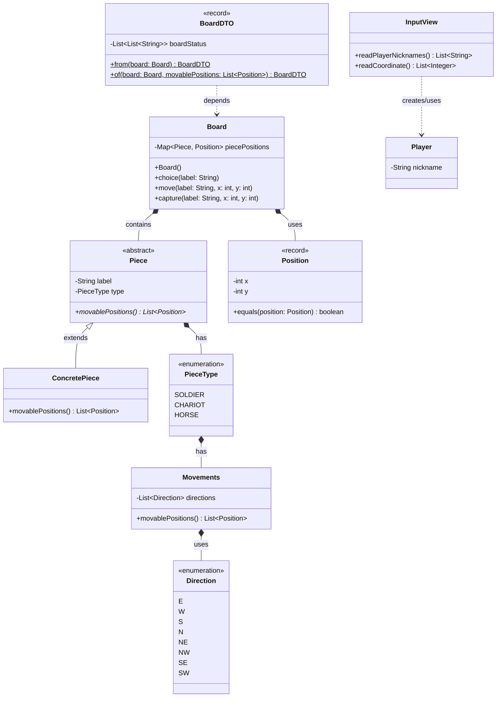

# 📖 장기 미션

## 🚀 미션 2-1 : 장기

---

## **산출물**

- [x] 설계 초안 (자료구조, 클래스 구상)

```mermaid

class Board - 게임판을 관리, 기물의 `좌표`와 `이동`을 관리
    Map<Piece, Position> piecePositions
    Board() - 초기 상태를 생성하고 그 값으로 위치 초기화
    void choice(String  label) - 특정 기물을 선택, 이동 가능 `위치` 표시
    void move(String  label, int x,int y) - 특정 위치의 기물을 이동
    void capture(String  label, int x,int y) - 특정 위치의 기물을 포기(捕棋)
    // Board(Map<Piece, Position> piecePositions) - 저장된 값, 변경된 값으로 초기화 `DB`
    
abstract class Piece - 기물의 라벨, 이동을 관리
    String label - 동일 기물도 특정하기 위한 별도의 이름
    PieceType type - 기물의 종류(졸 포 차 상 마 사 장)
    Player owner - 해당 기물의 주인 저장, 이후 게임 규칙에 사용
    abstract List<Position> movablePositions() - 이동 가능한 `위치`들
    
class <T> extends Piece - 기물의 구현체, 특정 기물 표현
    // 기물의 이동 규칙은 기물의 종류(PieceType) 안에서 관리
    @Override List<Position> movablePositions() - 해당 기물의 이동 가능 `위치`들
    
enum PieceType - 기물의 종류, 해당 기물의 이동 규칙 관리
    SOLDIER(new Movements()), ...

class Movements - 기물의 이동 규칙을, 이동 경로를 관리
    List<Direction> directions - 방향을 조합해 이동의 경로를 관리, == 이동 규칙
    List<Position> movablePositions()
    
enum Direction - 개별적인 이동의 모든 경우의 수(8방위) 관리
    E(1,0), 
    W(-1,0),
    ...

record Positon - 기물 및 빈 칸의 좌표 표현
    int x - 행 번호
    int y - 열 번호
    @Override equals(Position position) - 다른 좌표와의 비교

record BoardDTO - 배치된 게임판의 상태 전달
    List<List<String>> boardStatus
    BoardDTO from(Board board)
    BoardDTO of(Board board, List<Position> movablePositions)

class Player - 장기를 플레이할 사용자
    String nickname

class InputView - 필요한 입력을 파싱할 뷰
    List<String> readPlayerNicknames()
    List<Integer> readCoordinate()

class JanggiRunner
    void initialJanggi
    void initialPlayers
    void printInitialSetup
    void runGame
        void playerTurn
        void printBoardStatus
        ...
    void printResult

```

- 실행 흐름
    - Board() 초기화. 기본값(원래 장기 배치) 에 맞춰 초기 상태 생성 `Map<Piece, Position> piecePositions`
    - 생성된 게임판의 초기 상태를 출력 `BoardDTO`
    - 플레이할 사용자들 닉네임 입력 `Player`
    - 각 플레이어의 턴 교대로 반복
        - 게임판 상태 출력 `BoardDTO`
        - 이동할 기물 선택 `String label`
        - 기물의 이동 가능한 위치 `List<Positon>` 을 반영해 출력 `BoardDTO`
        - 이동할 위치 선택 `String input` -> `int x` / `int y`
        - 이동한 결과 반영 `Board`
        - 이동한 결과 출력 `BoardDTO`
    - 게임판에 장이 1개가 될 때 까지 반복



---

- [x] 변하는 정보와 변하지 않는 정보를 분류하고, 각 상태의 관리 책임에 대한 의견을 작성해 주세요.

### 변하는 정보

- 기물의 위치 : `Board`
- 기물의 생사(상태) : `Board`
- 참가자 차례 : `JanggiRunner`
- 참가자 승패 : `JanggiRunner`

### 변하지 않는 정보(상수?)

- 보드의 크기 : `Board`
- 좌표의 범위 : `Position`
- 참가자 인수 : `JanggiRunner`
- 참가자 이름 : `Player`
- 기물의 이름 : `Piece`
- 기물의 종류 : `PieceType`
- 기물의 소속 : `Piece` / `Player` 기물이 어디 속해있는지 누가 알아아햐나? `Board` > 기물 자체가 `Player` 를 소유자 로 가지기
- 기물의 이동(규칙) : `PieceType`
- 게임의 규칙 : `Board`
    - 같은 좌표에 도달한다면 : `Board`
        - 동일한 플레이어의 기물이라면 이동 불가 : `JanggiRunner`
        - 상이한 플레이어의 기물이라면 기물 포획 : `JanggiRunner`
    - 이동 경로에 다른 기물이 있다면 이동 불가 : `JanggiRunner`

---

- [x] 분석한 기물별 이동 규칙을 정리하고, 예상되는 조건문 개수와 잠재적 문제점을 작성해 주세요.

### 기물별 이동 규칙 개수

- `졸` : 상1 좌1 우1
- `포` : 건너뛰어서만 상0/하0/좌0/우0 + `포는 건너뛰기 불가`
- `차` : 직선으로 상0/하0/좌0/우0
- `마` : 상1/하1/좌1/우1+좌대각1/우대각1
- `상` : 상1/하1/좌1/우1+좌대각1,좌대각1/우대각1,우대각1
- `사` : 상1/하1/좌1/우1
- `장` : 상1/하1/좌1/우1

### 예상되는 조건문 개수
각 위치의 이동 가능 여부(장외, 다른 기물) 각 2번씩,
*
모든 이동에 대한 경우의 수 `3 + 0(N) + 0(N) + 8 + 8 + 4 + 4<br/>(27 + 2N) * 2`
+
포넘기

---

- [x] 조건문 없이 처리할 수 있는 구조적 대안에 대한 아이디어를 작성해 주세요.
  - 이동을 위와 같이 8개 방위로 분리
      - 상/하/좌/우/좌상/우상/좌하/우하
  - 각 이동의 조합으로 이동 경로를 표현
  - 이동 경로를 확인, 기물 여부와 좌표 범위 식별
  - 이동 가능 여부, 포기(捕棋) 가능 여부 판별

하는 식으로 구조를 작성하면

- 조건문을 대폭 감소시킬 수 있을 것으로 예상되고,
  - 다만 이동 경로에서 포는 포를 검사하게? 해야 할 것으로 예상
  - 결국 if 문 완벽한 배제는 불가능하겠지만
  - 불필요한 if 문 폭발을 방지하고
  - 중복 코드의 대폭 감소는 가능할 것으로 예상 
