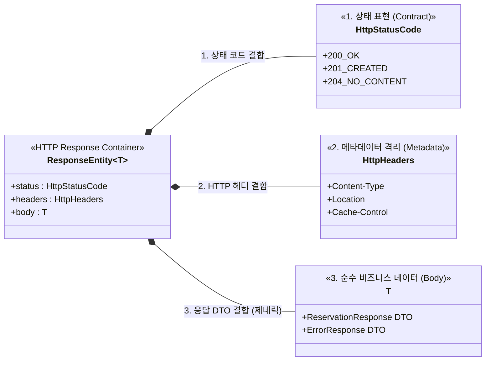

## 학습 로그 #01

### **시간**: 04/29 18:45 ~ 19:10 (약 25분)

### **학습 범위**: 1단계 MVC - `ResponseEntity`, `ResponseEntity.build()`

### 1. 막힌 것의 종류

이번에 막힌 것은 어떤 종류의 어려움이었는가? (해당하는 것에 체크)

- [ ] 개념 자체를 모르겠다 (예: "스프링 빈이 뭔지 모르겠다")
- [ ] 개념은 알겠는데 코드로 어떻게 쓰는지 모르겠다 (예: "JdbcTemplate 문법을 모르겠다")
- [ ] 코드는 돌아가는데 이게 맞는 건지 모르겠다 (예: "계층 분리를 이렇게 해도 되나?")
- [x] 아는 코드고 잘 돌아가지만 제대로 이해하지 못했다

### 2. 이번 타임의 학습 전략

### `ResponseEntity`

`P` ResponseEntity 도입 목적과 필요성은?

- 웹 통신 규약에 맞춰 상태 코드와 body를 다 보내기 위한 객체이지 않을까?

`i` 도입 목적부터

- 맞다. 상태 코드, 본문, `헤더` 를 객체로 조립해서 응답하기 위한 `표준 컨테이너`

`i` 각 구성 요소의 필요성

- **상태 코드** : 요청의 결과, 즉 상태를 규약에 맞춰(코드) 명시하기 위해
- **헤더** : 응답에 담아야 할 `메타데이터` 를 담기 위해
- **본문** : 응답에 담아야 할 비즈니스 데이터를 담기 위해
-
    * 과거에 사용된 `HttpServletResponse` 를 순수 자바 객체로 추상화하기 위해 도입됨
-
    * 서블릿 컨테이너의 이해에서 봤던 내용인데 기억이 안난다

`F` 아웃풋을 먼저 냈으니(구현) 일단 한바퀴

`S` ResponseEntity 와 내용을 mermaid 로 구조화



`R` 고마워요 제미나이! 스프링 공식문서도 함 찾아봐야..

---

### `ResponseEntity.build()`

`P` 헤더와 상태 코드는 있되 본문이 없는 응답을 보내기 위함?

```java
/**
 * Build the response entity with no body.
 * @return the response entity
 * @see BodyBuilder#body(Object)
 */
<T> ResponseEntity<T> build();
```

> 그렇다.

### 3. 전략 평가

- 효과적이었던 것과 그 이유
    - 배경 지식과 생각을 바탕으로 `P` 를 추론하고 그게 맞으니 진행이 훨씬 순탄함
- 비효과적이었던 것과 그 이유
    - 비효과적?인건 없었는데 피드백을 먼저 진행하는 식으로 비순차적 학습을 진행함
- 막힌 것의 종류(1번)와 전략의 궁합은 어땠는가?
    - 배경 지식이나 생각, 경험을 녹여내서 막힌 것을 효과적으로 해결할 수 있었다
    - 각 과정과 내용, 생각을 PiFSP 에 맞춰 더욱 구조적으로 정리할 수 있었다

### 4. AI 피드백

- 자신의 학습 전략에 대해 AI 학습 전문가에게 피드백을 요청하고,
  유용했던 제안 1가지 이상 기록

```text
과거 기술에 대한 '기억의 공백' 방치: 아니오.
로그 내 "HttpServletResponse를 추상화하기 위해 도입됨 
-> 서블릿 컨테이너 내용인데 기억이 안 난다"라고 명시하고 이를 그대로 넘긴 것은 
치명적인 학습 부채(Learning Debt)를 남기는 행위입니다. 

새로운 아키텍처나 프레임워크 객체의 존재 이유는, 
이전 기술이 가진 한계와 고통을 해결하기 위함입니다. 
이전 기술의 맥락을 상실한 채 ResponseEntity의 사용법만 익히는 것은, 
왜 그 도구가 만들어졌는지 모른 채 망치질만 반복하는 것과 같습니다.
```

> 의도한 학습 부채 나이스

```text
전문가의 멘탈 모델: 마틴 파울러의 관점에서, 
프레임워크가 제공하는 '우아한 추상화(ResponseEntity)'의 진정한 가치는 
그 추상화가 없던 시절의 I/O 스트림 예외 처리와 원시 타입 조작의 
물리적 고통을 마주해야만 체득됩니다. 
이 쓰레기 코드(Spike)를 직접 타이핑해 보면, 
서블릿 컨테이너의 동작 원리가 강제로 복기되며 ResponseEntity가 지닌 
추상화의 강력함을 뇌에 영구적으로 각인할 수 있습니다.
```

> 확인~

### 5. 다음 타임에 바꿀 것

- 유지할 것과 그 이유
    - 일단 만족스러운 과정과 결과를 산출했기에 일단 이 방식을 그대로 유지
- 바꿀 것과 그 이유
    - 학습할 내용에 대한 내 지식이나 스택스가 달라질 수 있으므로 변경에 대한 유연성 유지
